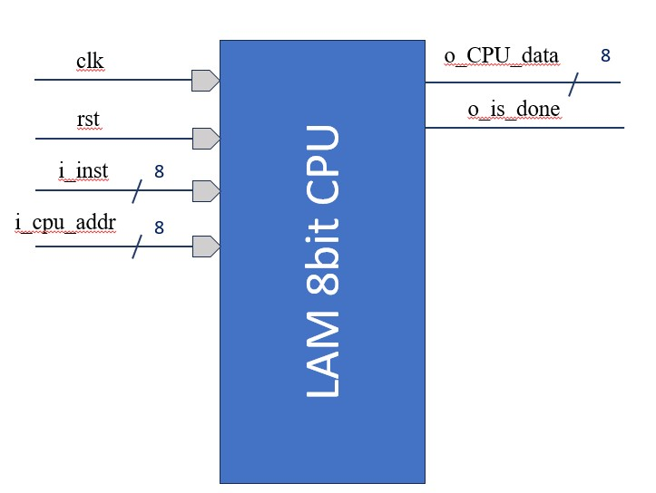
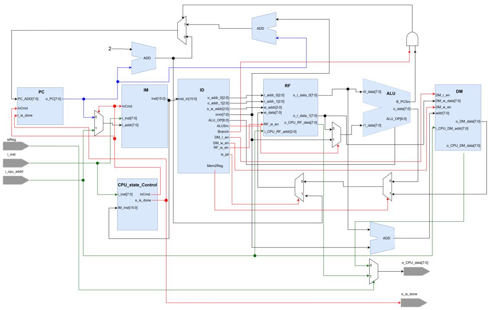
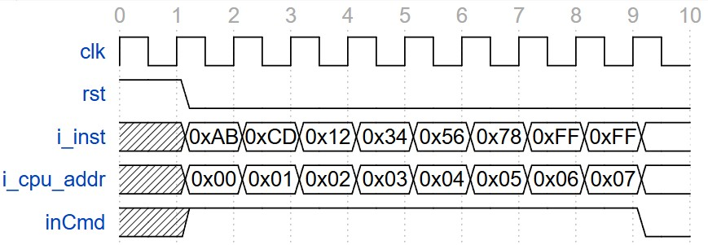

# LAM_8bitCPU

## 系統方塊圖

## ISA

## 架構圖

|Signal Name | I/O | Width | Simple Description |
|:---|:---:|:---:|:---
| clk   | I | 1 | Clock Signal (positive edge trigger) |
| rst   | I | 1 | Reset Signal (active high) |
| isReg   | I | 1 | 選擇選取Register File or Data Memory內容:  * 0:讀取Data Memory   *1: 讀取Register File |
| i_cpu_addr| I | 8 |在input instruction的時候   * 目前輸入的instruction 位置  選擇選取Register File or Data Memory內容情況:  * 輸入8bit的data當i isReg = 0時只會讀取i_cpu_addr [2:0]，因為Register File大小為8|
| o_CPU_data  | O | 8 | 輸出8bit的data |
| o_is_done   | O | 1 |輸出完成Signal   * 0: 未完成   * 1: 完成 |

## 系統介紹
### 指令輸入
如下圖waveform所顯示，當連續輸入2次0xFF之後會停止輸入指令，之後會執行程式。
當中`inCmd`代表目前是否在輸入指令，1: 目前輸入，0:目前沒有輸入

輸入完之後Instruction Memory內儲存的內容:
| Address | Data |
|:---:|:---:|
|0x00| 0xABCD |
|0x02| 0x1234 |
|0x04| 0x5678 |
|0x06| 0xFFFF |
### assebly code to machine code
`ass2Mach\ass2MachBinCode.py` 可以把 `assebly code` 轉成 `machine code`